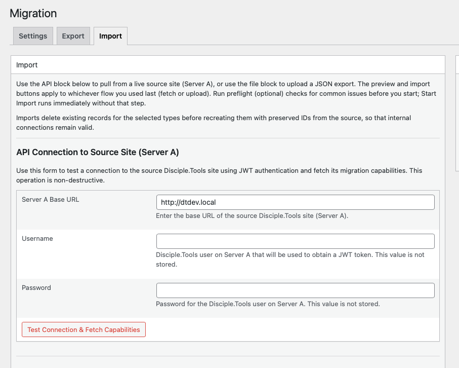

# Migration via API

In **API** mode, the **destination** site (Server B) connects to the **source** site (Server A) over HTTPS, authenticates, and **pulls** migration payloads through the `dt-migration/v1` REST namespace.

## Prerequisites

- Migration **enabled** on **both** sites
- **Server A** must expose the REST API and allow your Disciple.Tools user to authenticate (typically **JWT** via the `jwt-auth/v1` endpoints used by the plugin)
- You need a user on Server A with permission to call migration endpoints (same class of access as `manage_dt` for in-app REST checks)

## Connect from the destination

1. On the **destination**, open **Extensions (D.T)** → **Migration** → **Import**.
2. Under **API Connection to Source Site (Server A)**, enter:
   - **Server A Base URL** (e.g. `https://source.example.org`)
   - **Username** and **password** for a Disciple.Tools user on Server A  
   These credentials are used only to obtain a token; they are **not** stored.
3. Click **Test Connection & Fetch Capabilities**.

On success, the plugin stores **Server A Base URL** and a **JWT** for subsequent requests. You will see a **capabilities summary**: migration enabled flag, allowed settings categories, and allowed record types.

<!-- Screenshot: Import tab — API connection form and capabilities summary -->

## Preview and import

After a successful connection you can fetch **settings** and **records previews** from Server A (non-destructive). When you start an import:

- The destination may request **settings-only** export payloads and **paginated record batches** per post type (`offset` / `limit`).
- Record import uses the same **dependency-aware ordering** as file mode so related records stay consistent.

Optional **preflight** uses samples or batches from the source to surface warnings before you commit to a full import.

## Security notes

- Use **HTTPS** for both sites.
- JWTs are bearer tokens; anyone with the token and URL can act as that session until expiry — protect admin accounts on Server A and restrict who can run imports on Server B.
- See [Data and security](../reference/data-and-security.md) for what is never exported (passwords).

## See also

- [REST API reference](../reference/rest-api.md) — exact routes and parameters
