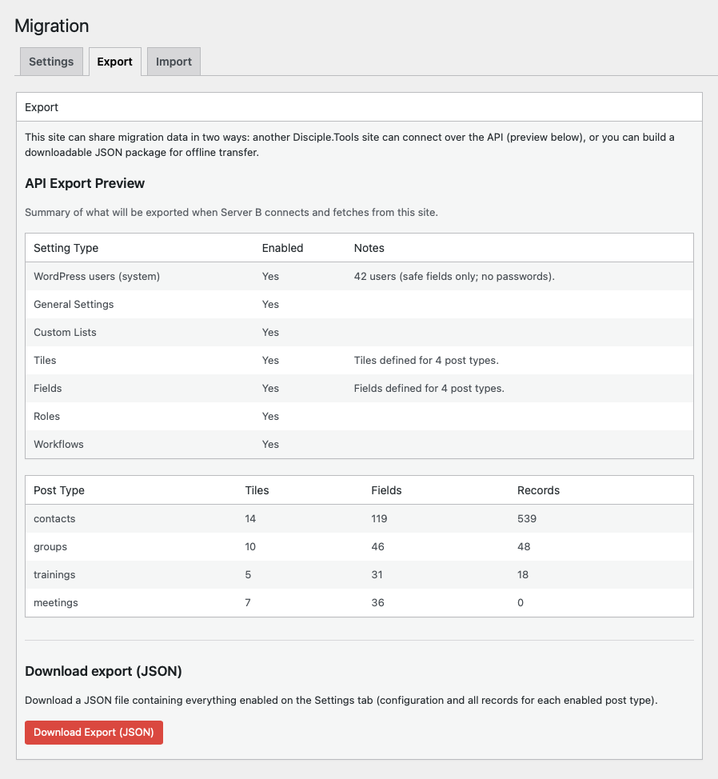
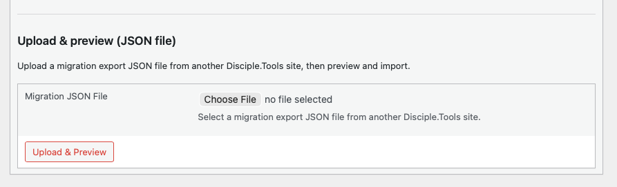

# Migration via file

Use a **downloaded JSON export** when the source and destination cannot talk to each other over the API, or when you want an auditable file to move through secure storage.

## Prerequisites

- Migration **enabled** on **both** sites
- On the **source**, the same **allowed items** you need must be checked on **Settings** (settings bundles and record types)
- At least one **record type** enabled if you need record data (otherwise the download may contain only configuration)

## On the source site

1. Go to **Extensions (D.T)** → **Migration** → **Export**.
2. Confirm the **API Export Preview** tables match what you expect (counts per post type, enabled settings categories). This mirrors what is allowed for API consumers; the file download uses the same scope.
3. Under **Download export (JSON)**, submit the form to download a JSON file containing **everything enabled on Settings** — configuration and **all records** for each enabled post type (unless your site exposes optional per-type range/limit controls via a developer filter).

<!-- Screenshot: Export tab with preview and download button -->

Advanced deployments can enable per-post-type **range** or **limit** controls for exports via the `dt_migration_show_export_record_filters` filter; default installs typically export **all** records for enabled types.

## Transfer the file

Use your organization’s secure channel (encrypted storage, controlled access). The file contains **user metadata and records**; treat it as sensitive.

## On the destination site

1. Go to **Extensions (D.T)** → **Migration** → **Import**.
2. In the **file** section, upload the JSON export.
3. Use **preflight** if you want warnings about collisions or field mismatches (see [Preflight and warnings](preflight-and-warnings.md)).
4. Choose what to apply (settings categories and record types) consistent with the export, then start the import. The UI runs imports in **stages** (settings, then records in **dependency-aware order** — for example types such as people groups and groups before contacts and trainings, then other enabled types).

<!-- Screenshot: Import tab — file upload area -->

## After import

Verify records, users, and configuration in Disciple.Tools. If something failed mid-run, check the messages in the import UI and use [Troubleshooting](troubleshooting.md).
