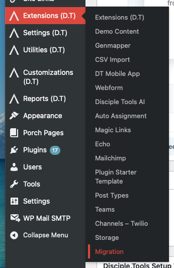

# Overview

The **Disciple.Tools – Migrations** plugin helps you copy Disciple.Tools **settings** and **records** from one WordPress site to another. You can work **through a downloadable JSON file** or **over the REST API** so the destination site pulls directly from the source.

## What you can migrate

When enabled, exports can include (according to your **Settings** checkboxes):

- **General settings**, **custom lists**, **tiles**, **fields**, **roles**, and **workflows**
- **WordPress users** (system users): profile and role information used by Disciple.Tools — **passwords are not included** in exports
- **Records** for each **Disciple.Tools record type** your site registers (for example contacts, groups, trainings, people groups, and custom types): including comments and structure needed to preserve **connections between records**

Imports on the destination are designed to **replace** existing data for the selected record types so that **post IDs** from the source can be preserved and relationships stay consistent. Treat the destination as a target you are intentionally overwriting for those types.

## Requirements

- **WordPress** 4.7+ (see plugin header for tested-up-to)
- **Disciple.Tools theme** version **1.20+** (the plugin checks the active theme version)
- A user with the **`manage_dt`** capability (Disciple.Tools administrator access) on **both** sites when performing exports and imports

## Where to find Migration in WordPress

Open the WordPress admin, then go to **Extensions (D.T)** → **Migration**. The screen has three tabs: **Settings**, **Export**, and **Import**. On **Settings**, you can set how long **file import jobs** stay in the database after a JSON upload; on **Import**, the **Recent file migration jobs** table shows status and optional **Retry** / **Delete** actions (see [Migration via file](migration-via-file.md)).

<!-- Screenshot: WP Admin sidebar → Extensions (D.T) → Migration -->

You can also open the same screen with explicit tabs, for example:

- `admin.php?page=disciple_tools_migration&tab=settings`
- `admin.php?page=disciple_tools_migration&tab=export`
- `admin.php?page=disciple_tools_migration&tab=import`

Older bookmarks that pointed at separate export or import submenu slugs are redirected to the main Migration screen with the matching tab.

## Next steps

- [Settings and scope](settings-and-scope.md) — enable migration and choose record types
- [Migration via file](migration-via-file.md) or [Migration via API](migration-via-api.md) — pick a channel
- [Preflight and warnings](preflight-and-warnings.md) — optional checks before import
