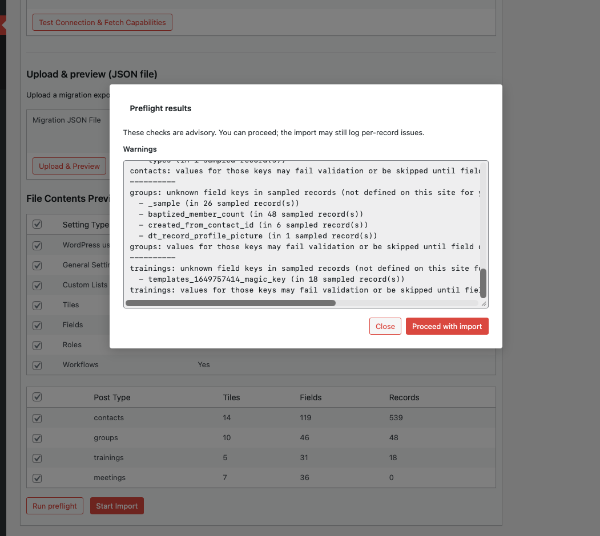

# Preflight and warnings

**Preflight** runs **non-destructive** checks before a full import. It helps surface mismatches between the **source export** and the **destination** site so you can fix issues or accept risk before overwriting data.

## When to use it

Use preflight when:

- You are importing **records** for types that already exist on the destination
- You are bringing in **fields** or **system users** where policies differ between sites
- You want a quick summary of **unknown fields** or **ID collisions** before a long import

You can still start an import without preflight; the UI offers both flows.

<!-- Screenshot: Preflight results list -->

## What preflight may report

Examples of messages you might see (wording comes from the plugin and may vary slightly by release):

- **Unknown or unexpected fields** on records compared to destination field definitions — especially relevant if you are **not** importing field definitions but are importing records that use custom keys from the source.
- **Post ID collisions**: exported IDs that already exist on the destination **for a different post type** — importing could overwrite or conflict; review before proceeding.
- **System users**: duplicate emails, missing export data when users were selected, or permission constraints (e.g. assigning administrator roles).
- **Multisite**: informational notes that roles are per-site and super-admin visibility may differ from single-site expectations.
- **Sample-based checks**: when the source is only partially sampled (e.g. first API batches), an info line may state that **not every record** was inspected.

Preflight is implemented to stay responsive on **large sites**: collision and lookup work is done in a way that scales to many IDs without loading each post individually in tight loops.

## Interpreting results

- **Warnings** are not always hard blockers; they are signals to review.
- **Info** lines explain context (multisite, sampling).
- If warnings are unacceptable, adjust **destination** data (delete conflicting posts, align field definitions), change **export scope** on the source, or import **settings** before **records**.

## See also

- [Troubleshooting](troubleshooting.md)
- [Data and security](../reference/data-and-security.md)
