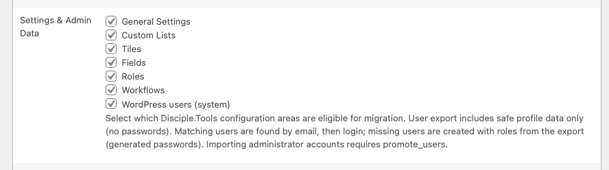
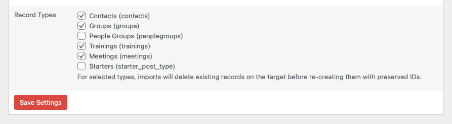
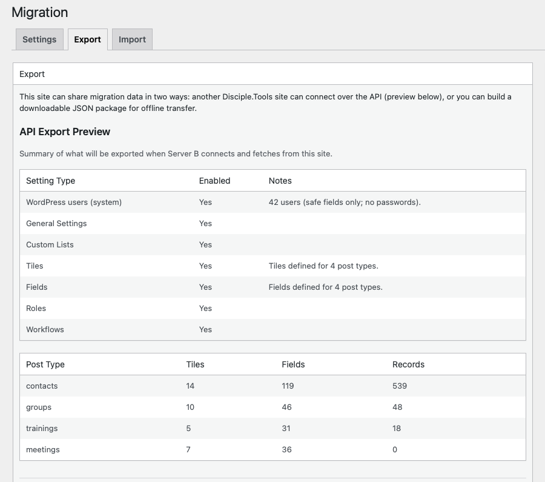

# Settings and scope

The **Settings** tab controls whether migration is allowed on this site and **which categories of data** may be included in exports (and therefore available to API consumers or file downloads).

## Enable migration

Turn on **Allow this site to perform Disciple.Tools migrations**. If migration is disabled, export and import actions are not available.

<!-- Screenshot: Settings tab — Enable migration and allowed items -->

## Settings and admin data

These options apply to **configuration**, not individual contact/group rows (except where noted):

| Option | Meaning |
|--------|---------|
| General settings | Core Disciple.Tools options eligible for migration |
| Custom lists | Custom list definitions |
| Tiles | Tile layouts per post type |
| Fields | Field definitions per post type |
| Roles | Role-related configuration included in the export |
| Workflows | Workflow definitions |
| WordPress users (system) | Safe user profile data; **no passwords**. See [Data and security](../reference/data-and-security.md) |

## Record types

Under **Record types**, enable each **Disciple.Tools post type** you want in exports and imports. The list reflects **all migratable types** registered on your site (labels shown in the UI; the internal slug appears in the description).

For each selected type, importing on a destination **removes existing records of that type** and recreates them using data from the source, **preserving IDs** where the import process allows, so links between records remain valid.

<!-- Screenshot: Record type checkboxes with plural labels and slugs -->

Save changes with **Save Settings**.

## API connection storage (destination)

The plugin stores the **source site base URL** and a **JWT** obtained after a successful connection test (see [Migration via API](migration-via-api.md)). **Username and password** used to fetch the token are **not** stored. JWT and URL are kept in the migration settings option for subsequent API import batches.

<!-- Screenshot: Optional — API section if shown on Settings in your build -->

## See also

- [Export tab](migration-via-file.md) — how the download reflects these choices
- [REST API capabilities](../reference/rest-api.md) — how the source reports `allowed_items`
