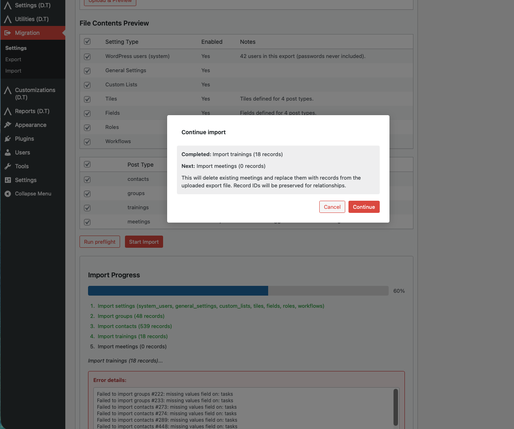

# Troubleshooting

## Migration is disabled

**Symptom:** Export or Import says migration is disabled.

**Fix:** On **Settings**, enable **Allow this site to perform Disciple.Tools migrations** and save.

## Permission errors

**Symptom:** Cannot access Migration screens or REST returns forbidden.

**Fix:** Use a Disciple.Tools account with **`manage_dt`**. Importing some user roles may require **`promote_users`** on the destination.

## API connection fails

**Symptom:** Test connection shows an error; no capabilities table.

**Checks:**

- **URL** is the site root (no trailing path to wp-admin required; use the public site URL pattern you use for REST).
- **HTTPS** and valid certificates.
- **JWT** plugin / `jwt-auth/v1` available on Server A and credentials correct.
- Firewall allows **Server B → Server A** requests.

Re-run **Test Connection** after fixing Server A. Clear old tokens by saving a fresh connection if the UI still fails.

## JWT expired or invalid

**Symptom:** Import batches fail after a delay.

**Fix:** Obtain a new token via **Test Connection** on the destination.

## Preflight shows ID collisions

**Symptom:** Warnings list post IDs that exist on the destination with a **different** type than the import expects.

**Fix:** Manually resolve conflicts (delete or rename the conflicting content), choose a clean destination database for those types, or adjust export scope. Do not ignore if you need strict ID preservation.

## Unknown field warnings

**Symptom:** Preflight lists fields on records that the destination does not recognize.

**Fix:** Import **fields** (and related tiles/settings) before records, or add matching field definitions on the destination first.

## User import / role messages

**Symptom:** Errors assigning roles, or unexpected role after import.

**Fix:** Ensure role slugs in the export **exist** on the destination. The import path validates roles and assigns a **safe default role** when an export row has no valid roles, so users are not left without a role mid-import. On multisite, add users to the subsite explicitly if they do not appear as expected.

## Large exports or timeouts

**Symptom:** Download or API batch stalls.

**Fix:** Increase PHP / web server timeouts where appropriate; for API imports, batches use pagination — retry from the UI. For very large file uploads, check `upload_max_filesize` / `post_max_size` and the database’s ability to store large options (or raise `max_allowed_packet` on MySQL if the host requires it for multi‑MB JSON).

## File import: no job or job not found

**Symptom:** Message that the **migration file job** is missing, not found, or no longer has a retriable copy; preflight or import cannot start.

**Common causes:**

- The JSON was **never uploaded** in this session, or the page was opened without using **Upload & Preview** or **Retry** for a job that still has data.
- The job **completed successfully** and the site **cleared the stored file** to save space (see [Migration via file](migration-via-file.md) — re-upload the export).
- The job was **deleted** from **Recent file migration jobs** or **aged out** by the **day limit** on **Settings** → **File import jobs**.

**Fix:** Upload the export again, or use **Retry** on a job that still lists retriable data. Adjust the retention day limit if you need jobs to last longer in the list.

## Import progress appears stuck (file import)

**Symptom:** Progress bar or counts stop updating during a file-based import.

**Fix:** Check browser **Network** for failed `admin-ajax.php` requests and read the JSON **response** for the error text. The UI surfaces the same message in the import panel. A **failed** or **cancelled** run updates the **Recent file migration jobs** status so you can **Retry** when the file is still stored. If the import **succeeded** but the list still looks odd, refresh the page — **Success** clears the stored JSON; **size** may show as a dash.

For **nonce** or permission errors, reload the admin page and start again from **Upload & Preview** or **Retry** (not only a hard refresh of a stale tab).

## Theme version notice

**Symptom:** Admin notice that Disciple.Tools theme is below required version.

**Fix:** Upgrade the **Disciple.Tools theme** to the version required by the plugin (see main plugin file / readme).

## Import progress appears stuck (general)

**Symptom:** Progress bar or counts stop updating.

**Fix:** For **API** imports, JWT expiry or network issues can interrupt long jobs — re-run **Test Connection** and try again. For **file** imports, see [Import progress appears stuck (file import)](#import-progress-appears-stuck-file-import) above. In all cases, check the error text in the import UI, browser **Network** responses, and server error logs; partial imports may leave records half-imported depending on the stage, and you may need cleanup or a targeted re-run.

<!-- Screenshot: Import progress / batch UI -->

